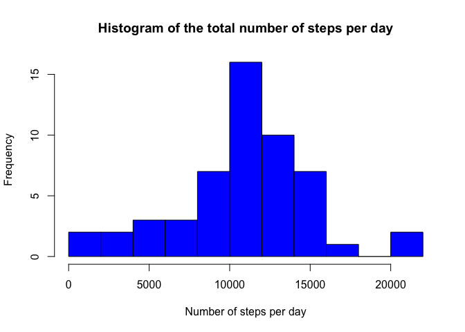
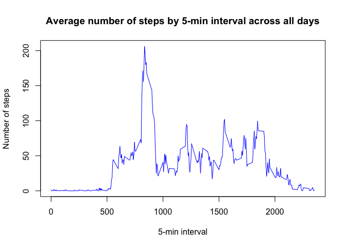
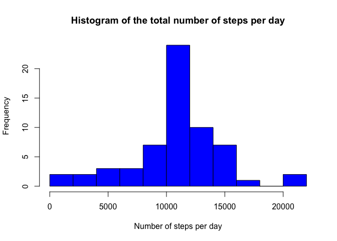
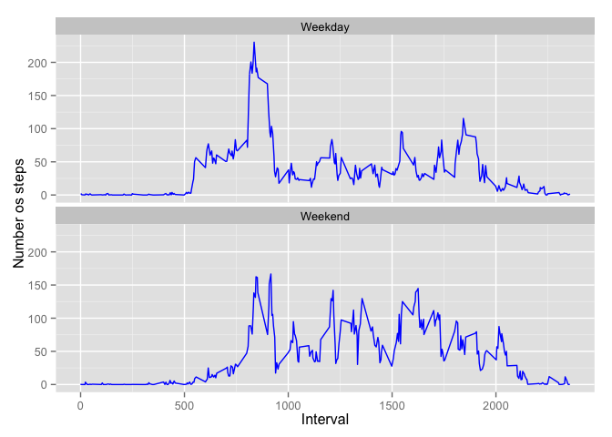

# Reproducible Research: Peer Assessment 1


## Loading and preprocessing the data

Here I load the data:

```r
activity <- read.csv("activity.csv")
```
The date column is a factor

```r
class(activity$date)
```

```
## [1] "factor"
```
We need to change it to a date class (important for the last section, when we have to use the weekdays() function) :

```r
activity$date <- as.Date(activity$date)
class(activity$date)
```

```
## [1] "Date"
```

## What is the mean total number of steps taken per day?

I sum up all steps by day, ommiting NA values:

```r
f <- aggregate(steps ~date, data = activity, sum, na.omit = TRUE)
```
And I plot the histogram of the total number of steps per day across the activity period:

```r
hist(f$steps, col = "blue", breaks = 10, xlab="Number of steps per day", main = "Histogram of the total number of steps per day")
```

 

The mean and the median of the number of steps per day are :


```r
mean(f$steps)
```

```
## [1] 10767.19
```

```r
median(f$steps)
```

```
## [1] 10766
```

## What is the average daily activity pattern?


```r
x <- aggregate(steps ~interval, data = activity, mean, na.omit = TRUE)
plot(x, type = "l", col = "blue", xlab ="5-min interval", ylab = "Number of steps", main = "Average number of steps by 5-min interval across all days")
```

 

The 5-minute interval that contains the maximum number of steps is 835.


```r
x[x$steps==max(x$steps),1]
```

```
## [1] 835
```

So the average daily activity pattern seems to be:  
-  a high intensity in the morning between 8am and 9am  
-  followed by an average of 50 steps every 5 minutes between 9am and 7pm  
-  and an activity pause between 10pm and 5am 

## Imputing missing values

The total number of missing values is 2304.


```r
sum(as.numeric(is.na(activity$steps)))
```

```
## [1] 2304
```

I choose to fill in all the NA values with the mean of the corresponding 5-min interval we calculated earlier:

```r
activity$na_flag <- as.numeric(is.na(activity$steps))
a<-activity[activity$na_flag==1,]
for (i in 1:nrow(a)) {
    activity[activity$na_flag==1,]$steps[i] <- x[x$interval==a$interval[i],2]
}
```

The new histogram looks like:

```r
ff <- aggregate(steps ~date, data = activity, sum)
hist(ff$steps, col = "blue", breaks = 10,xlab="Number of steps per day", main = "Histogram of the total number of steps per day")
```

 

The new mean and the median of the number of steps per day are :


```r
mean(ff$steps)
```

```
## [1] 10766.19
```

```r
median(ff$steps)
```

```
## [1] 10766.19
```

The treatment choosen for the NA values did not impact really much the mean and the median, except that they are now equal, but it definitely reduced the spread of daily total numbers of steps.

## Are there differences in activity patterns between weekdays and weekends?

Let's now create the "weekday"" and "weekend"" attributes in our transformed dataset:

```r
activity$weekday <- weekdays(activity$date)
for (i in 1:nrow(activity)){
    if(activity$weekday[i] %in% c("Saturday","Sunday")){
        activity$weekend[i] <- "Weekend"} 
    else {
        activity$weekend[i] <- "Weekday"}
}
```
I use ggplot2 to create a time series plot of the 5-minute interval (x-axis) and the average number of steps taken, averaged across all weekday days or weekend days (y-axis):

```r
xx <- aggregate(steps ~interval+weekend, data = activity, mean)
library(ggplot2)
ggplot() + 
    coord_cartesian() +
    scale_x_continuous() +
    scale_y_continuous() +
    facet_wrap(~weekend, nrow=2, ncol=1) + 
    labs (x = "Interval",y = "Number os steps")+
    layer(
        data=xx, 
        mapping=aes(x=interval, y=steps), 
        stat="identity", 
        stat_params=list(), 
        geom="smooth", 
        geom_params=list(color="blue"), 
        position=position_jitter()
    )
```

 

We can see that there are some differences in activity pattern between weekdays and weekends:  
-  In weekends the activity starts later in the morning than in weekdays.  
-  The total number of steps is more distributed across the day in the weekend than in the weekdays.
